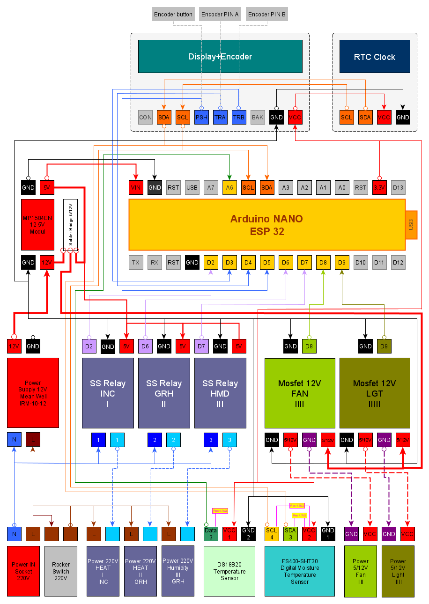

# Hardware — Arduino Nano ESP32

Target: **Arduino Nano ESP32** (`arduino:esp32`, board `Arduino Nano ESP32`).

Pin names use **Arduino notation** (D2, A4, …).

All SSR/relay outputs are **HIGH-trigger** (HIGH = on). After reset: **LOW** (off) for **3 s** (`OUTPUT_BOOT_HOLD_MS`).

**Safety:** work on mains (~230 V) and sensors only with power **off** — [USER_GUIDE](USER_GUIDE.md#safety-wiring-and-service).

## Wiring diagram

- [PDF](docs/Psi_Unit_Wiring_Diagram.pdf)
- Parts list — [BOM.md](BOM.md)

## Power distribution

Mains **230 V AC** → **Mean Well IRM-10-12** → **12 V DC** bus:

| Rail | Source | Consumers |
|------|--------|-----------|
| **5 V** | **MP1584EN** (12 V → 5 V) | Arduino **VIN**/5 V |
| **5 V** | 12 V bus (PCB) | SSR G3MB-202P coils |
| **3.3 V** | Arduino regulator | OLED, RTC, SHT30, DS18B20, MOSFET logic |
| **12 V** or **5 V** | 12 V bus via **Solder Bridge** | MOSFET loads (**FAN**, **LGT**) |

**Solder Bridge:** default **12 V** (12 V fan/strip). Re-soldered → **5 V** loads only. Match loads before first power-on.

Set **MP1584EN** to **5.0 V** at the controller input.

## Pin map

| Device | Pin | Address / protocol |
|--------|-----|-------------------|
| Encoder CLK (A) | D4 | — |
| Encoder DT (B) | D3 | — |
| Encoder SW | D5 | — |
| RELAY_FAN | D8 | Load 12 V or 5 V (PCB bridge) |
| RELAY_LIGHT (PWM) | D9 | Same as FAN |
| SSR_INC | D2 | — |
| SSR_HEAT | D6 | — |
| SSR_HUM | D7 | — |
| OLED SH1106 | A4/A5 | 0x3C (fallback 0x3D) |
| FS400-SHT30 | A4/A5 | 0x44 |
| DS3231 RTC | A4/A5 | 0x68; backup **CR2032** — [USER_GUIDE](USER_GUIDE.md#ds3231-rtc-and-backup-battery-vbat) |
| Settings | on-chip flash | **NVS** (`Preferences`) |
| DS18B20 | **A6** (GPIO 13) | OneWire |

## I2C

- SDA **A4**, SCL **A5**
- Bus speed: **100 kHz** at start
- SHT30: one T+RH read per poll (~2 s, `READ_INTERVAL`)

## Pin conflicts (Nano ESP32)

| Pin | GPIO | Avoid |
|-----|------|-------|
| A4 | 11 | **D11** |
| A5 | 12 | **D12** |
| **A6** | **13** | Do not use D11, D12, A4, A5 for DS18B20 |

**DS18B20** — **A6 only**.

## DS18B20

- **4.7 kΩ** pull-up: DATA → 3.3 V
- Power **3.3 V**, common GND
- Libraries: **OneWire**, **DallasTemperature**
- Init **after** I2C

## Required libraries

| Library | Role | Tested |
|---------|------|--------|
| **U8g2** | OLED SH1106 | 2.35.19 |
| **Encoder** | Rotary + button | 1.4.4 |
| **RTClib** | DS3231 | 2.1.4 |
| **OneWire** | DS18B20 | 2.3.8 |
| **DallasTemperature** | DS18B20 | 3.11.0 |
| **Adafruit SHT31 Library** | FS400-SHT30 | 2.2.2 |
| **Adafruit BusIO** | SHT30 dependency | (auto) |
| **ESPAsyncWebServer** | Web UI (`WIFI_ENABLE=1`) | 3.6.0 |
| **AsyncTCP** | TCP for web server | 3.3.2 |
| **LittleFS** / **FFat** | Sensor log (`SENSOR_LOG_ENABLE=1`) | esp32 core 3.0.x |

Board package: **esp32** **3.0.7**.

NVS: settings `psi_cfg`; Wi‑Fi `psi_wifi`; log meta `psi_log`. Log files on flash data partition (`/sl_*.bin`).

## Wi‑Fi (SoftAP)

- **SoftAP** only (not home-router STA)
- Menu: **SET → WiFi → Wi‑Fi SoftAP**
- SSID `PsiUnit-` + 4 hex digits; IP `192.168.4.1`
- **Off by default** until user enables (`WIFI_AP_AUTO_START=0`)
- Disable at build: `WIFI_ENABLE 0` in `firmware/Psi_Unit_Firmware/config.h`
- Details — [USER_GUIDE](USER_GUIDE.md#wifi-and-web-ui), [TEST_CHECKLIST](TEST_CHECKLIST.md) §6d

## Upload troubleshooting

If upload succeeds but the old sketch still runs: **Erase All Flash Before Sketch Upload → Enabled**, upload, reset, verify Serial **115200** shows `FIRMWARE_VERSION`, `Build:`, `Features:`.
