# BOM — Psi_Unit

> **Языки:** [English](../../BOM.md) | Русский

> Силовая часть **~230 V AC** — [USER_GUIDE](USER_GUIDE.md#безопасность-при-подключении-и-обслуживании), [HARDWARE.md](../../HARDWARE.md).  
> Распиновка — [HARDWARE.md](../../HARDWARE.md).

---

## Контроллер и интерфейс

| Фото | Компонент | Кол-во | Примечание |
|------|-----------|--------|------------|
|  | **Arduino Nano ESP32** | 1 | Плата **Arduino Nano ESP32**, ядро esp32 **3.0.7**. Настройки в **NVS** на чипе. Встроенный **RGB** — статус. |
| 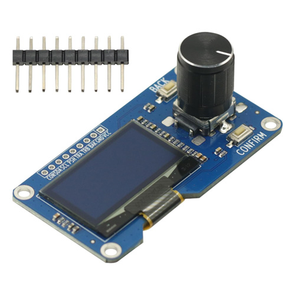 | **OLED SH1106 128×64** (I2C) | 1 | **A4/A5**, адрес **0x3C** (резерв **0x3D**). **U8g2**. I2C **100 kHz**. **3,3 V** с Arduino. |
|  | **Ротационный энкодер** (CLK / DT / SW) | 1 | **CLK → D4**, **DT → D3**, **SW → D5**. Библиотека **Encoder**. *На фото вместе с OLED.* |
|  | **Модуль DS3231** (RTC, I2C) | 1 | **A4/A5**, адрес **0x68**. **RTClib**. **3,3 V**. [Батарейка RTC](USER_GUIDE.md#часы-ds3231-и-резервная-батарейка-vbat). |
| 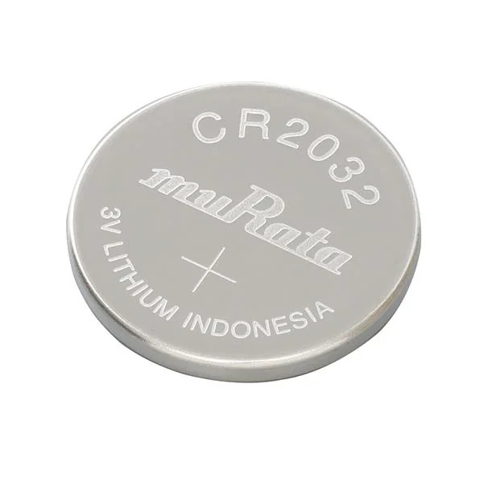 | **CR2032** (резерв RTC) | 1 | **VBAT** на DS3231. На ZS-042 отключить подзарядку — [USER_GUIDE](USER_GUIDE.md#часы-ds3231-и-резервная-батарейка-vbat). Замена при обесточенном приборе. |

---

## Силовые модули

| Фото | Компонент | Кол-во | Примечание |
|------|-----------|--------|------------|
| 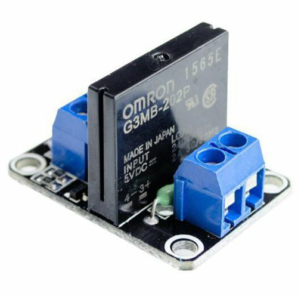 | **SSR G3MB-202P**, 1 канал, 5 V, HIGH-level (230 V AC) | 3 | **HIGH = вкл.** После сброса **выкл.** **3 с**. **SSR_INC → D2**, **SSR_HEAT → D6**, **SSR_HUM → D7**. Катушка **5 V**. Только **AC 230 V**; нагрузка **≥ ~0,1 A**. Монтаж при обесточивании. [Лимиты](USER_GUIDE.md#допустимые-нагрузки). |
| 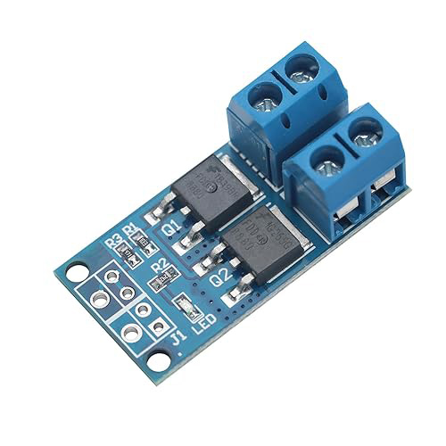 | **MOSFET-драйвер** 5–36 V, HIGH-trigger | 2 | **RELAY_FAN → D8**, **RELAY_LIGHT → D9** (PWM). Логика **3,3 V**; нагрузка **12 V** по умолчанию или **5 V** (перемычка **Solder Bridge**) — [HARDWARE.md](../../HARDWARE.md#power-distribution). |

---

## Распределение питания

| Фото | Компонент | Кол-во | Примечание |
|------|-----------|--------|------------|
|  | **Mean Well IRM-10-12** (230 V → 12 V DC) | 1 | Шина **12 V**: нагрузки MOSFET (по умолчанию **12 V**; **5 V** при перепайке моста), вход **MP1584EN**, SSR **5 V**. |
| 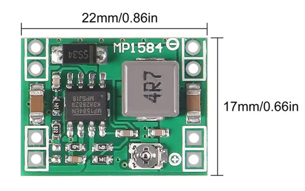 | **MP1584EN** (12 V → 5 V, до 3 A) | 1 | Плата контроллера **5 V**. Датчики, OLED, RTC, логика MOSFET — **3,3 V** с Arduino. |

---

## Датчики

| Фото | Компонент | Кол-во | Примечание |
|------|-----------|--------|------------|
| 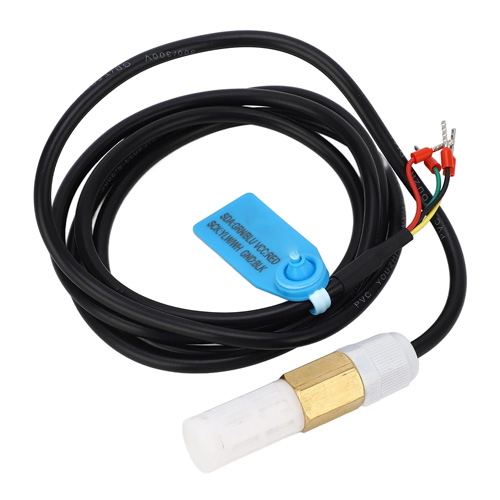 | **FS400-SHT30** (T + RH, корпус) | 1 | I2C **A4/A5**, **0x44**. **3,3 V**. Зона **GRH**. Подключать при обесточенном приборе. |
| 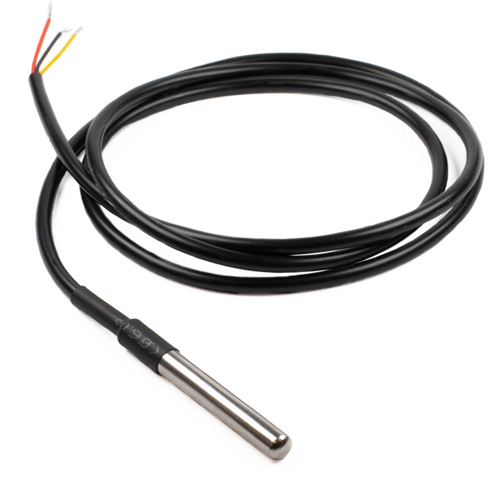 | **DS18B20** (OneWire) | 1 | Только **A6** (GPIO 13). Не D11, D12, A4, A5. **OneWire** + **DallasTemperature**. Зона **INC**. |
| 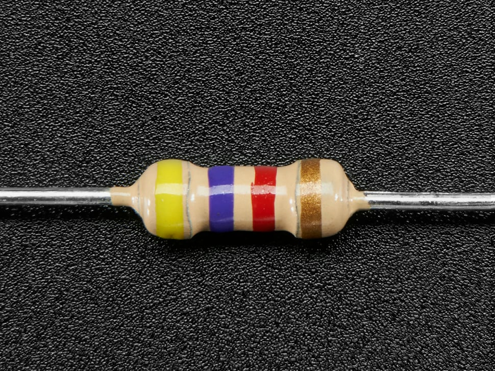 | **Резистор 4,7 kΩ** (pull-up OneWire) | 1 | DATA → **3,3 V**. Датчик **3,3 V**, общий GND — [HARDWARE.md](../../HARDWARE.md#ds18b20-wiring-and-libraries). |

---

## Нагрузки (примеры)

| Фото | Компонент | Кол-во | Примечание |
|------|-----------|--------|------------|
|  | **Trixie Fogger** увлажнитель (~25 W) | 1 | **HUM**, разъём **III**, SSR 230 V. Макс. **~230 W** — [USER_GUIDE](USER_GUIDE.md#допустимые-нагрузки). |
|  | **Lerway Indoor Greenhouse Heating Mat** 52,7×25,4 cm (~21 W) | 2 | **GRH** (разъём **II**) и **INC** (разъём **I**), SSR 230 V. Макс. **~230 W** на канал. |
| 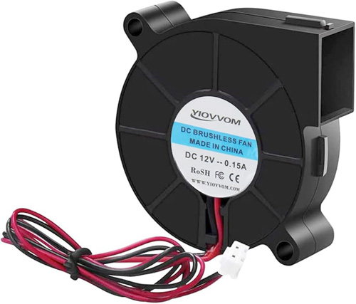 | **Вентилятор 12 V** 50×50×15 mm | 1 | **FAN**, разъём **IIII**. **12 V** по умолчанию; **5 V** при мосте на **5 V**. Макс. **~60 W** при 12 V. |
| 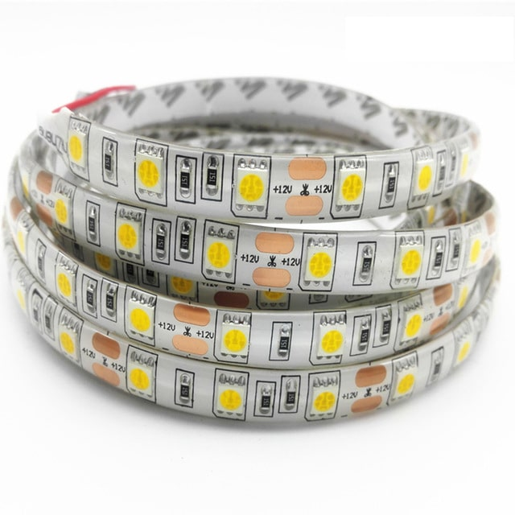 | **LED-лента 12 V** (~50 mm) | 1 | **LGT**, разъём **IIIII**, PWM на **D9**. **12 V** по умолчанию; **5 V** при мосте на **5 V**. Макс. **~36 W** при 12 V. |

---

## Разъёмы и коммутация

| Фото | Компонент | Кол-во | Примечание |
|------|-----------|--------|------------|
| 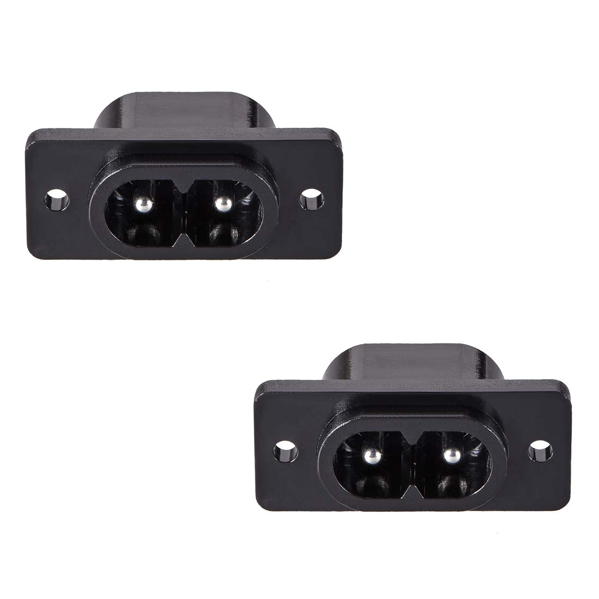 | **C8** IEC inlet (250 V / 2 A) | 4 | Ввод питания. [Маркировка](USER_GUIDE.md#маркировка-разъёмов-на-корпусе). |
| 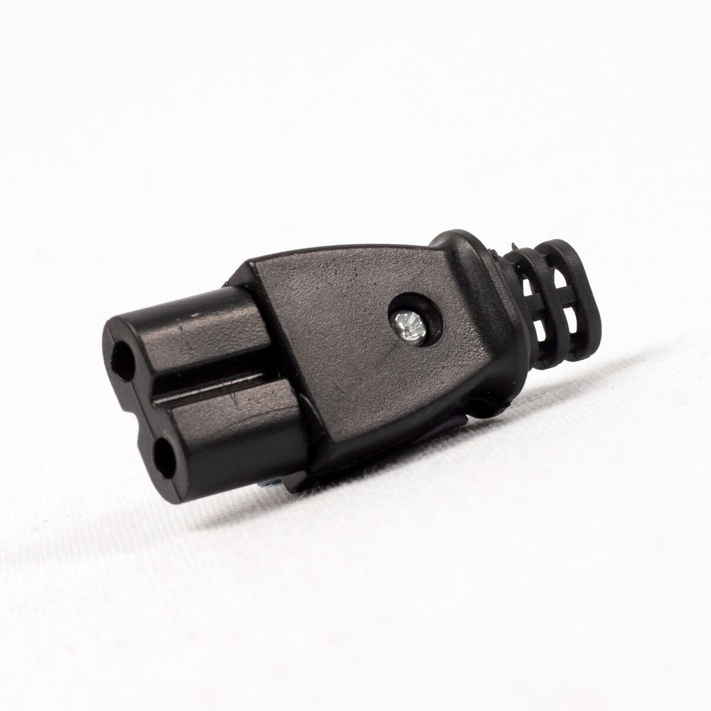 | **C7** вилка IEC (2 pin, 250 V / 2,5 A) | 3 | По схеме сборки. |
| 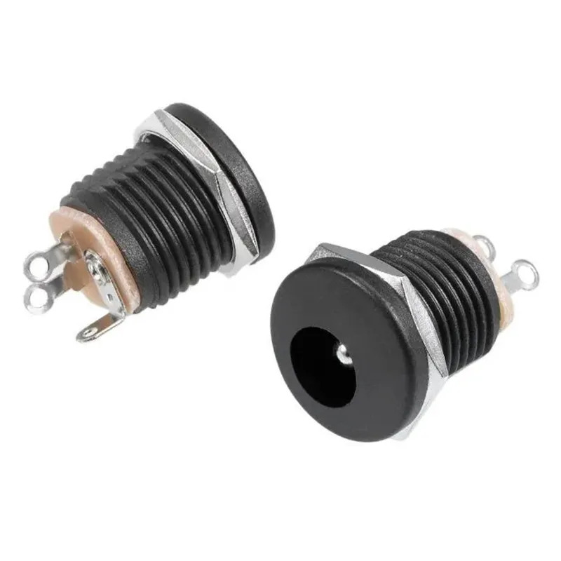 | **DC jack 2,1×5,5 mm** (панель) | 2 | Питание нагрузки 5–12 V. |
| 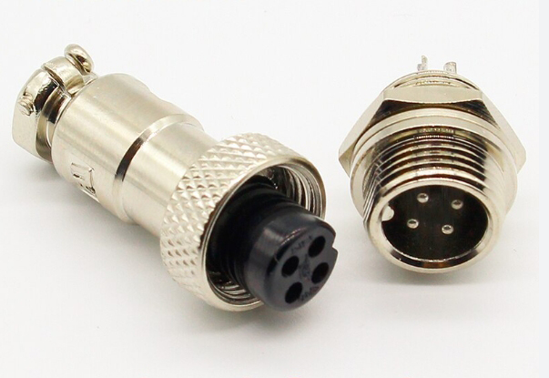 | **GX12-4** (4 pin) | 1 компл. | FS400-SHT30 (питание + I2C). |
| 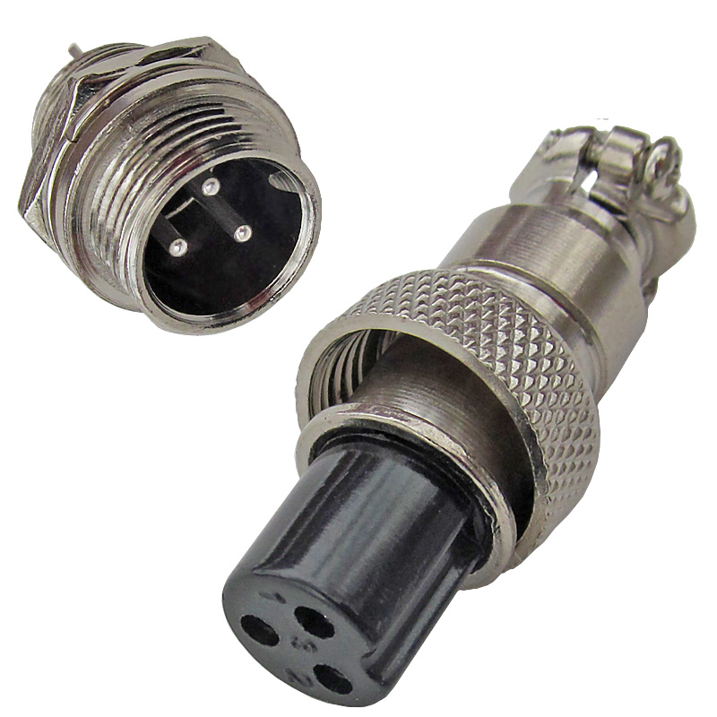 | **GX12-3** (3 pin) | 1 компл. | DS18B20 (VCC, DATA, GND). |
| 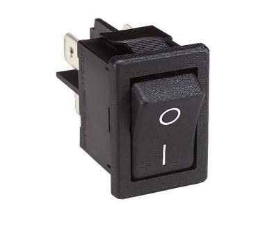 | **Rocker switch** H8550VBBB-080W-ND | 1 | Сетевой выключатель. |
| 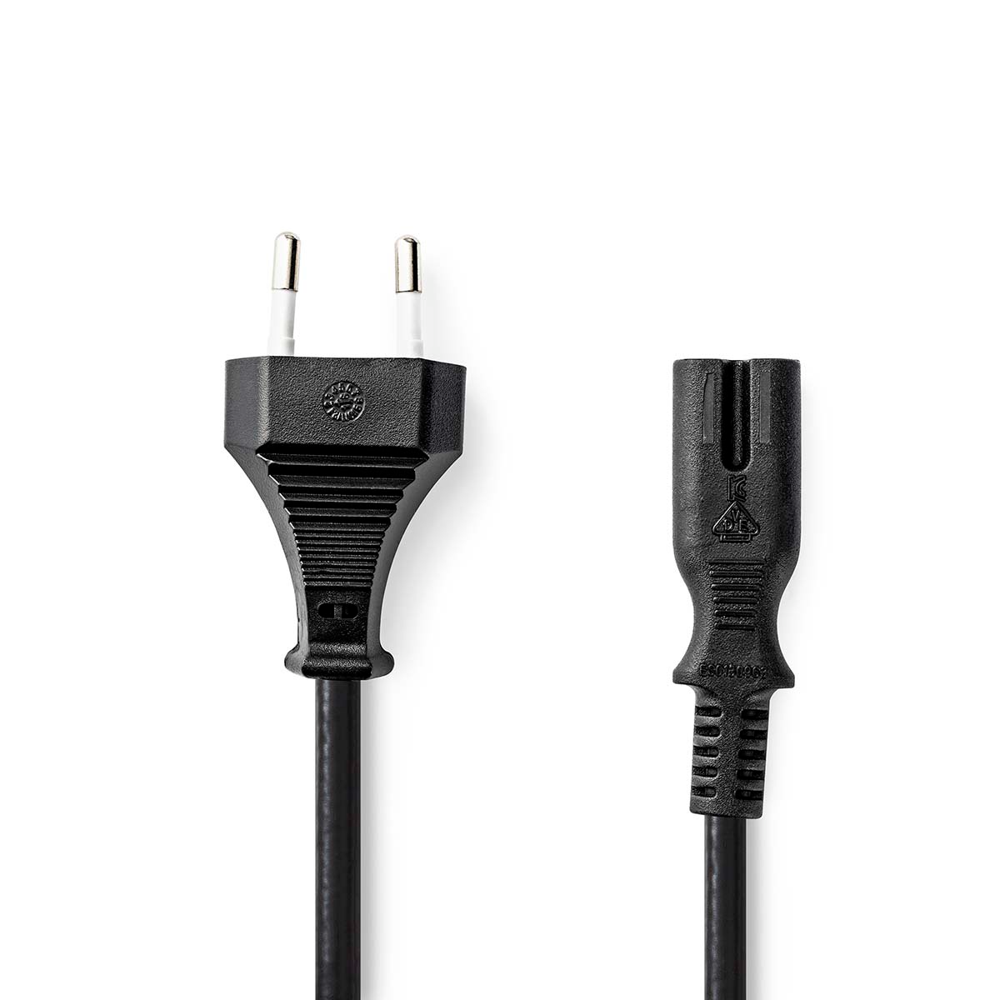 | **Кабель питания** 2 m, Euro, C7 | 1 | Только к маркированному разъёму питания. |

---

Схема: [HARDWARE.md](../../HARDWARE.md) · [PDF](../../docs/Psi_Unit_Wiring_Diagram.pdf) · [PNG](../../docs/Psi_Unit_Wiring_Diagram.png).
