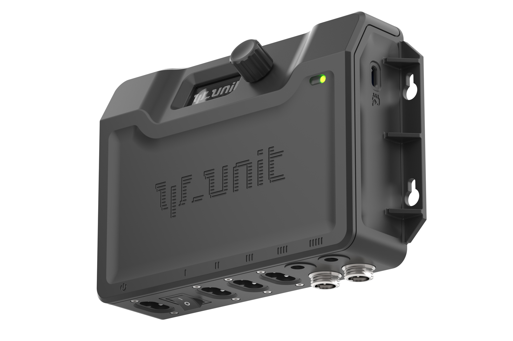

# Psi_Unit Firmware

> **Языки:** [English](../../README.md) | Русский

> ⚠️ **Отказ от ответственности.** Любительский проект без гарантий. Силовая часть (**~230 V AC**) — **на ваш риск**. Автор **не несёт ответственности** за травмы, пожар, порчу оборудования или иной ущерб.

Двухзонный климат-контроллер на **Arduino Nano ESP32**: датчики, OLED-меню, SSR/реле, настройки в NVS, опционально Wi‑Fi SoftAP и веб-UI.

**Версия:** `v0.1.0` (`FIRMWARE_VERSION` в `firmware/Psi_Unit_Firmware/config.h`)

## Структура репозитория

| Путь | Содержание |
|------|------------|
| **[firmware/Psi_Unit_Firmware/](../../firmware/Psi_Unit_Firmware/)** | Скетч Arduino и исходники — открыть `.ino` в Arduino IDE |
| [docs/](../) | Схемы подключения |
| [images/](../../images/) | Фото для README и BOM |
| [sim/](../../sim/) | Симулятор UI (SDL2) |
| [licenses/](../../licenses/) | Лицензии библиотек |

## Документация

| Файл | Содержание |
|------|------------|
| **[USER_GUIDE.md](USER_GUIDE.md)** | Эксплуатация — меню OLED, Wi‑Fi, безопасность, ошибки |
| [HARDWARE.md](../../HARDWARE.md) | Монтаж, пины, датчики, библиотеки, прошивка |
| [BOM.md](BOM.md) | Спецификация компонентов |
| [BOM (EN)](../../BOM.md) | Спецификация на английском |
| [TEST_CHECKLIST.md](../../TEST_CHECKLIST.md) | Проверка после прошивки |
| [ARCHITECTURE.md](../../ARCHITECTURE.md) | Структура прошивки |
| [sim/README.md](../../sim/README.md) | Симулятор UI (SDL2) |

## Возможности

- **Датчики:** FS400-SHT30 (T/RH), DS18B20 (вторая зона), DS3231 (RTC)
- **Выходы:** нагрев GRH и INC, увлажнитель, вентилятор (AUTO/MAN/ON/OFF), свет (PWM + расписание)
- **UI:** SH1106 128×64, энкодер, RGB, splash, экран SYS
- **Настройки:** двухбанковое NVS (`SETTINGS_VER` **25**)
- **Serial CLI** (115200): `help`, `dump …`
- **Wi‑Fi SoftAP** + веб (`http://192.168.4.1`): выкл. до **SET → WiFi → Wi‑Fi SoftAP → ON**
- **Журнал датчиков** во flash + графики (`SENSOR_LOG_ENABLE`)
- **Безопасность выходов:** boot hold 3 с, critical fault, failsafe — [USER_GUIDE](USER_GUIDE.md#ошибки-и-индикация)
- **Симулятор UI** (SDL2): [sim/README.md](../../sim/README.md)

MQTT и домашняя Wi‑Fi (STA) **не поддерживаются** — только SoftAP.

## Быстрый старт

1. **Arduino IDE** → ядро esp32 **3.0.7**, плата **Arduino Nano ESP32**
2. Библиотеки — [HARDWARE.md](../../HARDWARE.md#required-libraries)
3. Открыть **`firmware/Psi_Unit_Firmware/Psi_Unit_Firmware.ino`** → **Upload**
4. Если осталась старая прошивка: **Erase All Flash Before Sketch Upload → Enabled**, снова Upload, **RST**, Serial **115200** — проверить `FIRMWARE_VERSION`, `Build:`, `Features:` ([TEST_CHECKLIST](../../TEST_CHECKLIST.md))
5. Эксплуатация — [USER_GUIDE.md](USER_GUIDE.md)

## Релиз

1. Обновить `FIRMWARE_VERSION_*` в `firmware/Psi_Unit_Firmware/config.h`.
2. Обновить версию в README.
3. Коммит `Release vX.Y.Z`, тег, push.
4. Сборка → [TEST_CHECKLIST](../../TEST_CHECKLIST.md).

**Датчик vs библиотека:** **FS400-SHT30** (чип **SHT30**); в Library Manager — **Adafruit SHT31 Library** (I²C **0x44**).

Лицензии: [licenses/](../../licenses/). Прошивка: [LICENSE](../../LICENSE).

## Serial CLI

Serial Monitor **115200**, **Newline**. См. [TEST_CHECKLIST](../../TEST_CHECKLIST.md) §9.

| Команда | Назначение |
|---------|------------|
| `help` | Список команд |
| `dump` / `dump all` | Полный снимок |
| `dump settings` | Уставки из NVS |
| `dump outputs` | Состояние выходов |
| `dump ui` | Текущий экран |
| `dump wifi` | Состояние SoftAP |
| `wifi start` / `wifi stop` | Вкл. / выкл. SoftAP |

Отключить: `#define SERIAL_CLI_ENABLE 0` в `firmware/Psi_Unit_Firmware/config.h`.
